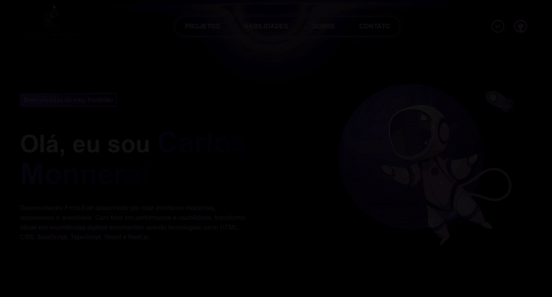

# 🌐 Carlos Monnerat – Portfólio Pessoal

Este é o repositório do meu portfólio pessoal, desenvolvido com foco em apresentar meus principais projetos, habilidades e experiências como desenvolvedor. A proposta é criar uma interface moderna, responsiva e funcional, utilizando tecnologias atuais como Next.js, React, Typescript e Tailwind CSS.

🚧 Aviso: Este repositório ainda está em fase de desenvolvimento. Por isso, algumas funcionalidades e links podem não estar totalmente implementados ou funcionando corretamente. Atualizações serão feitas em breve.

---

## 🎥 Apresentação

<p align="center">
  
</p>

---

## ✨ Funcionalidades

- ⚛️ Interface moderna com React 19 e Tailwind CSS 4
- 📱 Layout responsivo para mobile e desktop
- 💌 Formulário de contato funcional com integração via EmailJS
- 🎥 Suporte a vídeos com o pacote `next-video`
- 🌙 Modo escuro (dark mode) pronto para uso

---

## 🔗 Acesse meu Portifólio

👉 [**Acessar o site**](https://carlosmonnerat-portifolio.vercel.app/)

---


## 🛠️ Tecnologias utilizadas

| Ferramenta        | Descrição                                  |
|-------------------|--------------------------------------------|
| [Next.js 15](https://nextjs.org/)             | Framework React com suporte SSR/SSG |
| [React 19](https://react.dev/)                | Biblioteca JS para interfaces       |
| [Tailwind CSS 4](https://tailwindcss.com/)    | Estilização moderna e responsiva    |
| [Lucide Icons](https://lucide.dev/)           | Ícones vetoriais bonitos e leves    |
| [EmailJS](https://www.emailjs.com/)           | Envio de e-mails pelo frontend      |
| [TypeScript](https://www.typescriptlang.org/) | Tipagem estática para JS            |


---


## 📦 Como rodar localmente

1. Clone o repositório:
```bash
git clone https://github.com/CarlosMonnerat/personal-portfolio.git
cd personal-portfolio
```

2. Instale as dependências:
```bash
npm install
# ou
yarn
```

3. Crie um arquivo `.env.local` com suas variáveis do EmailJS (opcional)

4. Inicie o ambiente de desenvolvimento:
```bash
npm run dev
# ou
yarn dev
```

Acesse em `http://localhost:3000`.


---


## 🪪 Licença

Este projeto está sob a licença MIT.  
Sinta-se à vontade para usar como base para o seu próprio portfólio!